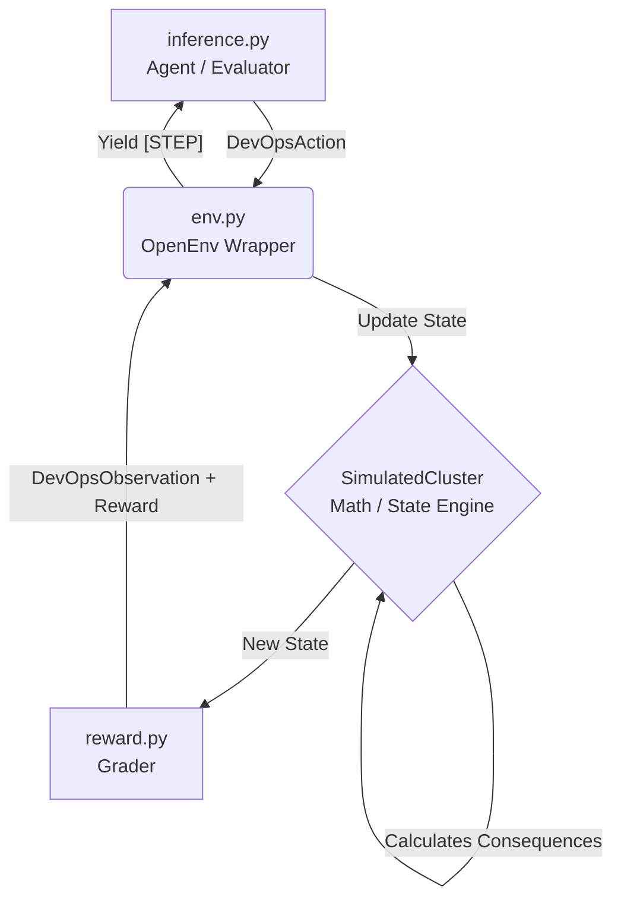

# 🚀 DevOpsEnv: Autonomous SRE Incident Response

**A deterministic Reinforcement Learning environment simulating a microservice cluster to train AI agents in diagnostic reasoning, dependency mapping, and SLA recovery.**


---

## 🎯 Executive Summary for Judges

Most reinforcement learning environments designed for LLMs are highly abstracted "toy" problems—navigating grid-worlds or solving simple math puzzles. In the real world of Enterprise DevOps and SRE, toil is expensive, systems are complex, and cascading failures wait for no one. 

**DevOpsEnv** bridges the gap. It is a robust, deterministic environment that evaluates an AI agent's ability to act as a Site Reliability Engineer. Instead of simply testing text generation, this environment rigorously grades an LLM's capacity for:
- 🔍 **Root Cause Analysis (RCA)** in the face of red herrings.
- 🕸️ **Dependency Mapping** across distributed microservices.
- ⏱️ **SLA Recovery** via actionable mitigation steps.

### 🏆 OpenEnv Hackathon Compliance
- **100% Secure**: Zero hardcoded secrets. Environment variables strictly enforce `$HF_TOKEN`.
- **Hugging Face Verified**: Container successfully hosts an HTTP listener on port `7860`, responding natively with HTTP `200 OK` to the official `POST /reset` validation hook. Space transitions cleanly to the `Running` state!
- **Format Compliant**: Custom stdout logger perfectly formatted for the official RegEx parser (`[START]`, `[STEP]`, `[END]` with explicit lowercase `bool` and floating-point scoring `score=0.00`).
- **Stateless & Deterministic**: Zero database footprint; math-based metric progression operating far below the `<8GB RAM` limit. All transitions are purely deterministic.

---

## 🏗️ System Architecture & Execution Flow



**1. `inference.py`**: The agent runtime evaluation loop, wired safely via `from openai import OpenAI`. Features a built-in Hugging Face HTTP health-check server.
**2. `env.py`**: Standardized environment wrapper handling the `step()` and `reset()` lifecycles.
**3. `SimulatedCluster`**: The core mathematically modeled microservice mesh (auth-service, frontend, payment-api, user-api, recommendation-engine).
**4. `reward.py`**: The dynamic grading engine enforcing advanced Reinforcement Learning penalty shaping.

---

## 📊 State Spaces (Pydantic Typed)

### The Observation Space (`DevOpsObservation`)
A strict telemetry snapshot JSON returned to the agent:
* **`step`**: Current iteration integer.
* **`active_alerts`**: Simulated PagerDuty/Prometheus alerts.
* **`services`**: Live system health dictionaries (`status`, `cpu_utilization`, `p99_latency_ms`, `error_rate_pct`, `hourly_cost_usd`).
* **`recent_deploy_history`**: Deployment timeline array to catch bad rollouts.

### The Action Space (`DevOpsAction`)
Agents explicitly output actionable tasks matching a strict JSON schema:
* `action_type`: `["acknowledge_alert", "rollback_deploy", "restart_pod", "scale_up", "investigate_logs", "wait"]`
* `target_service`: Downstream service tag.
* `version_tag`: Optional release parameter.

---

## ⚔️ The Scenarios

| Difficulty | Task Name | Description |
| :--- | :--- | :--- |
| **Easy** | `ghost-in-the-pod` | `payment-api` throws 503s. Tests basic alert recognition and mitigation sequences. |
| **Medium** | `silent-budget-burn` | Cost Anomaly Detection. `recommendation-engine` is burning 400x hourly budget. Tests non-fatal optimization skills. |
| **Hard** | `the-cascade` | A complex cascading failure originating from `auth-service`, triggering chain-reaction 500 errors in downstream APIs. Tests upstream dependency mapping. |

---

## ⚖️ Advanced Reward Shaping

RL environments are defined by grading mechanics. DevOpsEnv aggressively punishes "Lazy LLM" behaviors:

### 🔄 The Anti-Loop Penalty
LLMs frequently hallucinate loops, repeating safe actions when confused. DevOpsEnv tracks `previous_action` states and applies an exponential penalty multiplier (`1st repeat = -0.1`, `nth = -0.3`) for blind repetition.

### 🩹 The Band-Aid Penalty
Agents often attempt to fix the symptom rather than the source. If an agent targets the `frontend` during a cascade while the core `auth-service` dependency is offline, the environment triggers a strict `-0.2` penalty and adds an explicit `"Band-aid applied"` error.

### 🐟 The Red Herring
During cost-burn tasks, DevOpsEnv deterministically injects a `"minor CPU fluctuation"` alert on an unrelated service. Agents that target the wrong service fall for the distraction and receive an immediate penalty.

---

## 🛠️ Setup & Evaluation Instructions

**1. Define Environment Variables**
Configure connectivity (defaulted to Hugging Face Serverless endpoints):
```bash
export API_BASE_URL="https://router.huggingface.co/hf-inference/v1/"
export MODEL_NAME="Qwen/Qwen2.5-7B-Instruct"
export HF_TOKEN="hf_your_token_here"
```

**2. Run via Docker (Hackathon Format)**
```bash
docker build -t devops-env:latest .
docker run --rm -p 7860:7860 -e HF_TOKEN="$HF_TOKEN" devops-env:latest
```

**3. Audit the Standard Output Trace:**
Monitor the local console for mathematically derived grading traces, formatted stringently for validation parsing:
```text
[START] task=the-cascade env=devops-env model=Qwen/Qwen2.5-7B-Instruct
[STEP] step=1 action={"action_type":"rollback_deploy"...} reward=0.40 done=false error=null
[END] success=true steps=5 score=1.00 rewards=0.40,-0.05,0.10,0.20
```

---
*Built safely for the Meta & Hugging Face OpenEnv Hackathon.*
